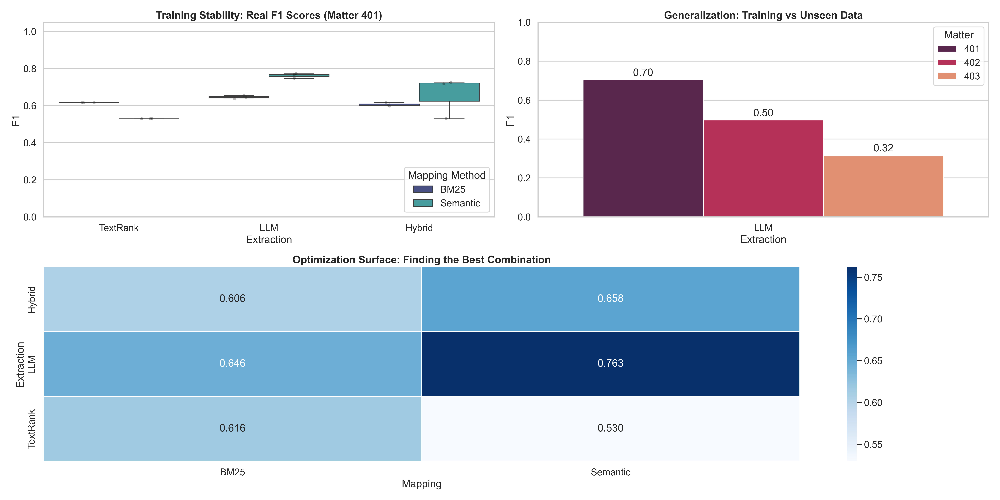

# Atomic Unit Relevance Assessment (AURA) Framework
### Automated Legal e-Discovery Optimization using LLMs & Combinatorial Search

  

**Quick Links:** 
[View Notebook](https://nbviewer.org/github/anitaxokojie/AURA-Legal-Framework/blob/main/aura_pipeline.ipynb) | [Results](#2-quick-results) | [How It Works](#3-how-it-works) | [Getting Started](#9-getting-started) | 


**Tech Stack:** Python, Google Gemini API, NetworkX, SentenceTransformers, Scikit-Learn
**Dataset:** NIST TREC 2011 Legal Track (~4,500 Document Sample)

---

## 1. Why This Matters
Traditional legal document review is expensive and slow. Attorneys manually review thousands of documents looking for relevant evidence. 
*   **Keyword Search (Ctrl+F):** Has terrible precision (high false positives).
*   **TF-IDF:** Catches synonyms but misses semantic relationships (e.g., "grid failure" vs "blackout").

**The Solution:** I built a system that extracts high-level themes from documents using LLMs, then uses semantic similarity to find related documents. 

**The Result:** Attorneys can recover **75% of relevant evidence** while reviewing roughly **half the volume** they would normally need to look at. Think of it as "Smart Ctrl+F"—instead of searching for exact phrases, you search for concepts.

## 2. Quick Results
I benchmarked the pipeline against standard baselines on the NIST TREC dataset.

| Method | F1 Score | Precision | Recall |
| :--- | :--- | :--- | :--- |
| Random Baseline | 0.503 | -- | -- |
| Keyword Search | 0.323 | -- | -- |
| TF-IDF (Traditional) | 0.634 | 63% | 66% |
| **AURA (This Project)** | **0.763** | **74%** | **75%** |
| **Improvement** | **+20.2%** | -- | -- |

> **Business Impact:** With 74% precision, an attorney reviewing 1,000 documents flagged by the system would find ~740 actually relevant ones, versus having to review 2,000+ documents manually to find the same amount.

### Performance Visualizations

*Figure 1: (Top Left) Training stability comparisons showing LLM+Semantic dominance. (Top Right) Generalization gap across legal matters. (Bottom) Optimization surface heatmap identifying the winning architecture.*


## Code Architecture
### Core Pipeline Components

**1. LLM-Based Theme Extraction**
```python
def extract_atomic_units(text, model):
    """Extract legal themes using Google Gemini"""
    prompt = f"""Extract key legal themes from this document.
    Focus on: entities, dates, dollar amounts, legal issues.
    Document: {text}"""
    
    response = model.generate_content(prompt)
    return response.text
```

**2. Semantic Document Ranking**
```python
# Encode themes and documents into 384-dim vectors
theme_embeddings = model.encode(atomic_units)
doc_embeddings = model.encode(documents)

# Calculate cosine similarity scores
similarity_scores = cosine_similarity(theme_embeddings, doc_embeddings)

# Rank documents by relevance
ranked_docs = np.argsort(similarity_scores)[::-1]
```

**3. Combinatorial Optimization**
```python
# Test all 2^n combinations of themes
best_f1 = 0
for theme_combo in itertools.product([0,1], repeat=n_themes):
    relevant_docs = get_docs_matching_themes(theme_combo)
    f1 = calculate_f1(relevant_docs, ground_truth)
    if f1 > best_f1:
        best_combination = theme_combo
```

## 3. How It Works
The pipeline follows a three-step process to filter noise and identify signal:

1.  **Extract Themes:** Use Google's Gemini LLM to pull out high-level concepts ("Atomic Units").
2.  **Map to Documents:** Use semantic embeddings (`all-MiniLM-L6-v2`) to find documents related to those themes via Cosine Similarity.
3.  **Optimize:** Test all boolean combinations ($2^n$) of themes against ground-truth data to find the optimal query set. 

## 4. Key Technical Decisions

### Why LLM Over Hybrid Approach?
I tested three extraction architectures. Surprisingly, the **Pure LLM** beat the Hybrid approach.
*   **TextRank (Graph-based):** F1: 0.616
*   **Hybrid (TextRank + LLM):** F1: 0.657
*   **Pure LLM (Winner):** F1: 0.763

**Insight:** Graph-based preprocessing strips away subtle context. When I gave the LLM raw text, it preserved specific entities (dates, dollar amounts, proper names) like "$4.6 Billion" or "Richard Wills." These specific "hooks" were crucial for high-precision retrieval.

### Why Semantic Search Over BM25?
Lexical matching (BM25) gets trapped in exact keyword matching. Semantic embeddings understand that "power outage," "blackout," and "grid failure" are related concepts. This accounted for the massive jump in F1 score.

## 5. Project Structure
```text
aura-legal-framework/
├── aura_pipeline.ipynb        # Main experimental pipeline (with results)
├── requirements.txt           # Python dependencies
├── .env.template              # API Key configuration template
├── README.md                  # Project documentation
├── data/
│   ├── matter401/             # Training set (Financial Fraud)
│   ├── matter402/             # Test set (Energy Regulation)
│   ├── matter403/             # Test set (Environmental Compliance)
│   └── README.md              # Data context & licensing info
└── output/
    ├── pipeline_metrics.csv   # Experimental results data
    ├── results_summary.json   # Aggregated metrics
    └── qualitative_samples.csv # Comparison of LLM vs Hybrid outputs
```

## 6. Architecture: Vector-Based Relevance Propagation
The AURA framework moves beyond simple boolean search by implementing a continuous relevance ranking engine.

### The "Invisible Link": Cosine Similarity
Unlike keyword search (which is binary: match/no match), this pipeline creates a graded ranking for every document:
1.  **Vectorization:** Extracted "Atomic Units" and raw documents are encoded into 384-dimensional vectors using `all-MiniLM-L6-v2`.
2.  **Scoring:** The system computes the **Cosine Similarity** between specific Atomic Units and every document in the corpus.
3.  **Ranking:** This generates a leaderboard where documents with high semantic overlap float to the top.
4.  **Thresholding:** The Optimization Engine dynamically identifies the cut-off point on this leaderboard that maximizes the F1 Score, effectively filtering out "hallucinated" themes that do not correlate with relevant documents.

## 7. Legal & Historical Context
This project utilizes the **NIST TREC 2011 Legal Track** dataset, widely considered the "Gold Standard" for e-Discovery research. The corpus consists of emails seized by the **Federal Energy Regulatory Commission (FERC)** during the investigation into the **Enron scandal**.

The pipeline simulates a response to three distinct production requests (Topics):

*   **Topic 401 (EnronOnline):** Documents related to the design and operation of the EnronOnline trading platform (Financial Fraud).
*   **Topic 402 (Derivatives):** Legality and regulation of over-the-counter (OTC) derivatives and financial instruments (Energy Regulation).
*   **Topic 403 (Environmental):** Compliance regarding environmental regulations, emissions, and spill reporting (Operational Compliance).

## 8. What I Learned
*   **Good:** Stratified sampling is essential for maintaining class balance in legal datasets where "Relevant" documents are rare (often <10%).
*   **Challenge:** API rate limits are real. I had to implement robust **exponential backoff** and retry logic to keep the pipeline stable during batch processing.
*   **Reality Check (Domain Shift):** The model performed great on the training case (Enrononline) but showed a performance drop on test cases (Energy Regulation). This confirms that legal relevance is highly domain-specific.Performance drops on out-of-domain cases
  (Energy Regulation vs Financial Fraud) highlight the importance of domain adaptation. In production, this would be addressed through few-shot fine-tuning with case-specific seed documents—a standard practice in legal tech that I'd implement in the first deployment sprint)


## 9. Getting Started

### Prerequisites

1. Clone this repository:
```
   git clone https://github.com/anitaxokojie/AURA-Legal-Framework.git
```

2. Install dependencies:
```
   pip install -r requirements.txt
```

### Download Sample Data

Run this command to download the TREC dataset:
```
python setup_data.py
```

This downloads ~5MB from [GitHub Releases](https://github.com/anitaxokojie/AURA-Legal-Framework/releases) and creates:
- `data/matter401/` - Training set
- `data/matter402/` - Test set
- `data/matter403/` - Test set

### Configuration

Copy the template and add your API key:
```
cp .env.template .env
```

Then edit `.env` and add:
```
GOOGLE_API_KEY=your_key_here
```

### Run the Pipeline
```
jupyter notebook aura_pipeline.ipynb
```

## Project Context
**Type:** Industry Field Project (Academic)  
**Duration:** 5 months (May 205 - September 2025)  
**Industry Partner:** Elevate Law (US Legal Tech)  
**Collaboration Model:** Proof-of-concept developed with guidance from Elevate's Managing Director. Problem scope and dataset access provided by industry partner; implementation and evaluation conducted independently.  
**Deployment Status:** Research prototype.

*Available reference upon request from industry partner.*

### Future Roadmap
*   **Active Learning:** Implement a feedback loop where real attorney judgments update the model's decision boundary in real-time.
*   **Deployment:** Containerize the pipeline (Docker) and expose via FastAPI for integration into existing e-Discovery platforms.
*   **UI/UX:** Build a React-based frontend for attorneys to explore "Atomic Units" visually before committing to a review strategy.

---


**License:** MIT License.

**Contact:** Anita Okojie  | www.linkedin.com/in/anitaxo | anitaxokojie@gmail.com

**Built with☕** and way too many API retry attempts
